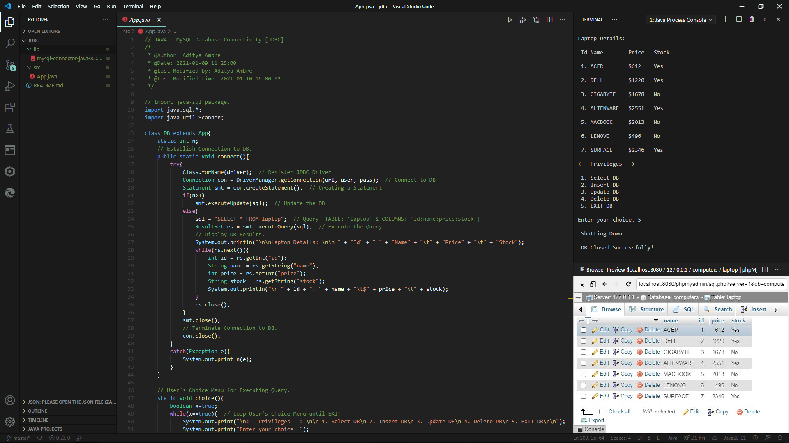

# JAVA - MySQL Database Connectivity [JDBC]



## Description

A simple Java program that executes _'SELECT', 'INSERT', 'UPDATE' & 'DELETE'_ queries using JDBC Driver for MySQL.

## Installation

The Java program executes MySql queries using JDBC Driver so ensure whether the following pre-requisites are met, in order to run it on your system.

### Pre-requisites:

[JDK - Java Development Kit](https://www.oracle.com/in/java/technologies/javase-jdk15-downloads.html)

```
OpenJDK - Minimum version required to run the program is 'OpenJDK 11.0.9.1' or above.
```

[XAMPP - X Platform-Apache-MariaDB/MySQL-Perl-PHP](https://www.apachefriends.org/download.html)

```
XAMPP - Minimum version required to run the program is 'XAMPP 3.2.2' or above.
```

[JDBC Driver for MySQL (Connector/J)](https://dev.mysql.com/downloads/connector/j/)

```
JDBC Driver - The JDBC Driver for MySQL with class name 'com.mysql.cj.jdbc.Driver' is required to establish a connection with MySQL DB.
```

## Author

- [Aditya Ambre](https://github.com/AdityaAmbre)

## License

This project is licensed under the Apache-2.0 License - see the [LICENSE.md](LICENSE) file for details.

Copyrights © - 2021 Aditya Ambre. │ All Rights Reserved.
